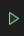

# SBB Mixed Reality

## About

**Project Title:** SBB: Preventive/Predictive Maintenance with AR Assistant

**Abstract:** This project presents a comprehensive mixed reality application
tailored for train door maintenance, utilizing the spatial computing
capabilities of the Microsoft HoloLens 2. We integrate several software packages
to provide a mixed reality application featuring: 1) Train door identification
via its unique label, which is scanned using OCR technology provided by Azure AI
Vision; 2) Accurate tracking of physical objects in 3D space using Azure Object
Anchors, and subsequent overlaying of a 3D model, or “digital twin”; 3) An
intuitive user interface for displaying repair manuals and a checklist to track
maintenance progress using the Mixed Reality Toolkit (MRTK3). We additionally
compare various approaches for 3D model tracking and evaluate respective
strengths and weaknesses when deployed to the Microsoft HoloLens 2. Finally, we
evaluate the effectiveness of the application using a comprehensive user study.

## Development “Quick”start

### Requirements and Set-up

#### :computer: Operating System

Development can only be done on Windows 10 or newer due to the reliance on .NET
products and other Microsoft services.

#### :video_game: Unity

The project is set up for Unity version **2023.1.14f1**. Other versions might
work, but the project must be ported manually. Additionally, use
the [Mixed Reality Feature Tool](https://learn.microsoft.com/en-us/windows/mixed-reality/develop/unity/welcome-to-mr-feature-tool)
to install the following additional Unity packages:

- Azure Mixed Reality Services &rarr; Microsoft Azure Object Anchors
- MRTK3 (all components)
- Platform support &rarr; Mixed Reality OpenXR Plugin

Optionally, you can also install support for Holographic Remoting:

- [HoloLens 2 Holographic Remoting Unity package](https://learn.microsoft.com/en-us/windows/mixed-reality/develop/native/holographic-remoting-overview)

#### :man_technologist: Visual Studio

A recent version of Visual Studio is required. The following additional
components need to be installed:

**Workloads:**

- .NET desktop development
- Desktop development with C++
- Universal Windows Platform development
- Game development with Unity

**Individual components:**

- Windows 10 SDK _or_ Windows 11 SDK (untested)
- \[Optional\] ARM64 Remote Debugger

> :warning: **Storage space requirements** :floppy_disk:
>
> The full installation for Unity +
> Visual Studio (including components) takes up about 70 GB of disk space when
> installed. Builds and projects incur an additional storage cost. A minimum of
> 100 GB free storage space are recommended.

#### :cloud: Microsoft Azure

We also use two Azure services:

- **Azure Object Anchors**, for 3D model tracking
- **Azure AI Vision**, for OCR

It is required to set up those services on your own Azure account and generate API keys which you can then use to make requests. Students get US$200 of free Azure credit that can be used for the project. Note that especially Azure AI Vision is subject to rate and monthly request limits.

##### Setting up Azure Object Anchors

Please first follow this guide: [Instructions for Azure Object Anchors](https://learn.microsoft.com/en-us/azure/object-anchors/quickstarts/get-started-model-conversion).

In the Unity project, under `Assets/AzureObjectAnchors.SDK/Resources` edit the `ObjectAnchorsConfig` ScriptableObject to contain your newly generated API keys.

 ##### Setting up Azure AI Visions

Please first follow instructions on this webpage: [Instructions for Azure AI Vision](https://learn.microsoft.com/en-us/azure/ai-services/computer-vision/overview-ocr).

In the Unity project, open the Script `Assets/Scripts/OCR/OCRManager.cs` and edit the `Endpoint` and `APIKey` constants to your own credentials.

#### :camera: 3D Object Capture

We used [PolyCam](https://poly.cam/) for scanning of 3D models using our mobile phones. On Android, you have 20 free scans after creating an account. The quality is sufficient for our purposes.

We then clean up the models in [Blender 3D](https://www.blender.org/). Note the difference in coordinate systems when exporting from Blender into Unity: **Blender** uses a **right-handed, z-up** coordinate system while **Unity** uses a **left-handed, y-up** coordinate system. We have found the **GLB** format most suitable for export from Blender as it can be used for

- Azure Object Anchor model conversion, includes textures
- Importing into Unity for visualization

When exporting from Blender to GLB, you can check the `Y-axis up` option to make it conform to Unity’s coordinate system.

### Project Setup

After installing all requirements, packages, and dependencies, open the Unity project from source and wait for all packages to finish importing. This can take a while.

#### Project Structure

The project is structured as standard Unity application. All user files are stored in the `Assets` directory and organized into file type/functionality. Important directories include:

| Directory | Purpose                                                      |
| --------- | ------------------------------------------------------------ |
| Materials | Unity materials for rendering                                |
| Models    | Raw 3D models imported from Blender                          |
| Prefabs   | Unity prefabs                                                |
| Scenes    | Unity scenes                                                 |
| Scripts   | C# scripts                                                   |
| Textures  | 2D image texture assets for use in materials or other purposes |

Other directories might be system-generated and generally should not be modified.

### Components

#### Object Tracking

Object tracking is managed with the Azure Object Anchors SDK and the main entry point is found in `ObjectTrackingManager.cs` on the similarly named GameObject. Properties and methods are documented in the source code.

In order for AOA to work, you need to set your API credentials as mentioned in the Set-up section.

#### OCR

For OCR we use the Azure AI Vision REST APIs using Unity’s built-in HTTP client. The main file is `OCRManager.cs` on the similarly named GameObject. Properties and methods are documented in the source code.

#### UI

We use MRTK3 for all of our UI components. This is motivated by the fact that the available components are tested from a UX perspective to be optimal for MR applications. All UI components are grouped under the “UI” GameObject. The app currently contains the following UI components:

- **HandMenuBase:** Contains all buttons for main functionality, as well as a few sub-menus:
  - Manage tracked objects
  - General notifications (last scanned door label)
  - Tracking status
- **PDFViewer:** The in-game PDF viewer.
- **CheckListMenu:** In-game, door-specific checklists
- **DebugPlaque:** Used for testing OCR in the Unity editor without having to build and deploy

### Deploying

Deploying is essentially a three-step process. The steps are detailed below.

#### Build Step 1: Build Unity Project

##### First-time Setup

First follow the instructions on how to properly configure an MRTK3 project in Unity: <https://learn.microsoft.com/en-us/windows/mixed-reality/mrtk-unity/mrtk3-overview/getting-started/setting-up/setup-new-project>. Follow the “UWP” route. Most importantly, set the build platform to:

- **Platform:** Universal Windows Platform
- **Architecture:** ARM 64-bit
- Remaining settings at their defaults

Under **Player Settings**, make sure that the following capabilities are enabled:

- InternetClient
- InternetClientServer
- PicturesLibrary
- PrivateNetworkClientServer
- Webcam
- Microphone
- Objects3D
- SpatialPerception
- GazeInput

**Supported devices** should be **Holographic**.

Ideally, these settings are already set when cloning the project from version control.

##### Build

When you want to create a new build, in Unity, select `File > Build Settings > Build`. If successful, this should produce a Visual Studio solution.

#### Build Step 2: Build Visual Studio Solution

Open up the newly created Visual Studio solution.

##### First-time Setup

In the top bar, make sure that **Release** and **ARM64** are selected. Additionally, you want to change Local Machine to **Remote Machine**. This will allow you to deploy to the HoloLens. Then follow the steps below to connect the solution to your HL:

1. On your HoloLens, shout “**What is my IP**” – Note that “What’s my IP” will not work (seriously)
2. Click the small arrow next to Remote Machine, and then select **SBB Mixed Reality MRTK3 Debug Properties** and select the  **Debugging** subsection.
3. Paste your HL’s IP into the **Machine Name** field. Press “OK” to apply.

##### Build

Build the solution by clicking `Build > Build Solution` or by using <kbd>Ctrl</kbd><kbd>Shift</kbd><kbd>B</kbd>. The first build can take up to 30 minutes, but will be faster (around 1-10 minutes) on subsequent builds.

#### Build Step 3: Deploy to HoloLens

Once the solution is built, turn on your HL and unlock it. Make sure your PC/laptop are connected to the same network, and press  **Start without Debugging**  in Visual Studio. This should automatically upload the code to your HL and start the application. This process takes usually around 2 minutes (depending on the executable size).